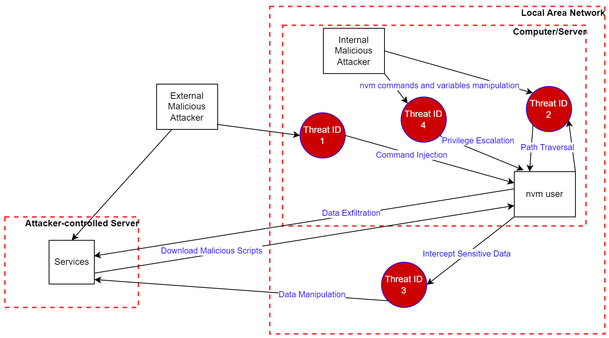
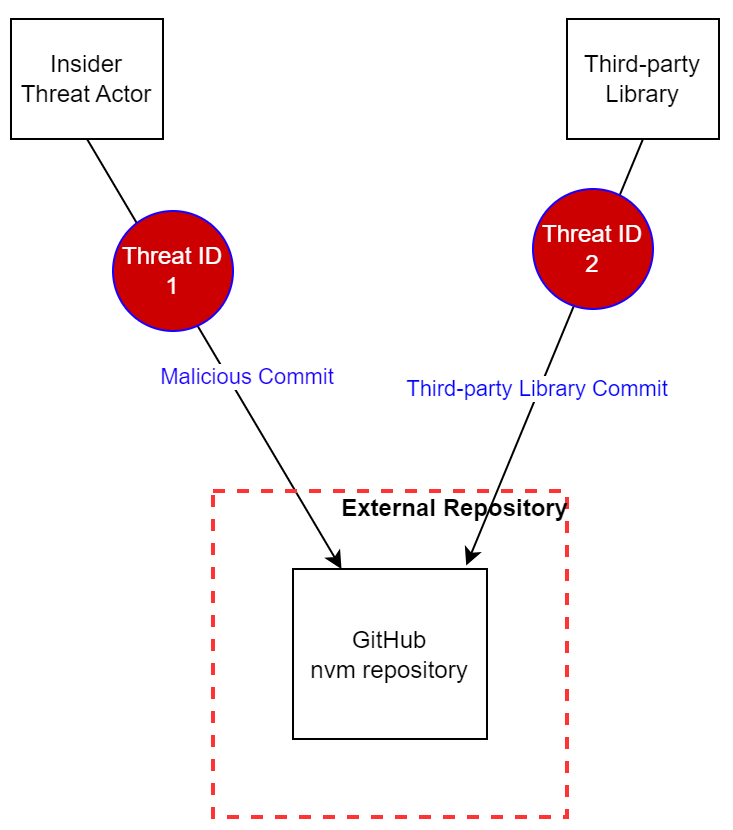

# `nvm` Threat Model

## Introduction

Threat model analysis assists organizations to proactively identify potential security threats and vulnerabilities, enabling them to develop effective strategies to mitigate these risks before they are exploited by attackers.
Furthermore, this often helps to improve the overall security and resilience of a system or application.

The aim of this section is to facilitate the identification of potential security threats and vulnerabilities that may be exploited by adversaries, along with possible outcomes and appropriate mitigations.

## Relevant assets and threat actors

The following assets are considered important for the `nvm` project:
  - `nvm` source code and project documentation
  - Underlying `nvm` dependencies
  - `nvm` development infrastructure
  - `nvm` installed devices including servers

The following threat actors are considered relevant to the `nvm` application:
  - External malicious attackers
  - Internal malicious attackers
  - Services
  - Malicious insider actors
  - Third-party libraries

## Attack surface for external/internal attackers and services

In threat modeling, an attack surface refers to any possible point of entry that an attacker might use to exploit a system or application.
This includes all the paths and interfaces that an attacker may use to access, manipulate or extract sensitive data from a system.
By understanding the attack surface, organizations are typically able to identify potential attack vectors and implement appropriate countermeasures to mitigate risks.

In the following diagrams, _External Malicious Attacker_ applies to threat actors who do not yet have direct access to the `nvm` application and the underlying operating system, while the _Internal Malicious Attacker_ applies to an attacker with access to the device (computer, server), potentially after successfully exploiting a threat from the _External Malicious Attacker_ scenario.
**Please note that some of the external threats may be also exploitable from internal threats and vice versa.**

Fig.: Possible attacks from internal and external threat actors and services

## Identified threats

The identified threats against the `nvm` application are as follows:

### Threat ID 1: `nvm` commands

Overview: The `nvm` commands and subcommands take user input for handling and executing appropriate functions from the project directory (or any parent directory).
When user-controlled inputs are not adequately validated and later passed to the `nvm` functions as a part of a command, an attacker might be able to execute operating system commands triggered by any parsing functionality.

Possible Outcome: Attacks against `nvm` commands could lead to unauthorized access to user data or unauthorized access to the device (i.e. laptop or server, depending on where `nvm` is installed), resulting in loss of user private data stored on the device, among other possibilities.

Recommendation: Input validation should be implemented to prevent attackers from requesting operating system commands.
Similarly, secure coding practices ought to be in place to minimize the risk of buffer overflow vulnerabilities.

### Threat ID 2: URI scheme

Overview: `nvm` commands heavily use the [Secure HyperText Transfer](https://datatracker.ietf.org/doc/html/rfc2660) protocol for `nvm` related actions.
Missing [scheme](https://datatracker.ietf.org/doc/html/rfc3986#section-3.1) validation for any `nvm` command might result in file retrieval, enumeration, file overwrite, or [path traversal](https://owasp.org/www-project-web-security-testing-guide/latest/4-Web_Application_Security_Testing/05-Authorization_Testing/01-Testing_Directory_Traversal_File_Include) attacks.
An example of this could be path validation for [`nvm_download`](https://github.com/nvm-sh/nvm/blob/ef7fc2f2c06ad75fe7fbabf28d427561ae7b007d/nvm.sh#L118), among many other possibilities.

Possible Outcome: Security misconfiguration flaws for URI scheme may lead to unauthorized access to user data, as well as data integrity compromises.

Recommendation: Adequate input validation should be implemented to prevent attackers from enumerating, retrieving and writing to application files and paths.

### Threat ID 3: Communication channel

Overview: The `nvm` commands and its subcommands use network protocol to communicate with external services.
Insecure communication may allow malicious attackers to perform [_Man-in-the-Middle_](https://owasp.org/www-community/attacks/Manipulator-in-the-middle_attack) attacks in order to manipulate the data sent during the users’ active connection.

Possible Outcome: Usage of plaintext communication protocols, like HTTP could lead to data sniffing and modification through insecure communications channels.

Recommendation: Mitigation countermeasures such as data encryption should be in place to prevent data manipulation via insecure communication channels.

### Threat ID 4: Environment variables

Overview: Each `nvm` installation defines its environment variables, which should be secured from internal malicious attackers, preventing access control attack vectors.
Missing stringent restrictions on setting variables, might allow attackers to prepare various targeted attacks against other local users, who use `nvm` in their user space.
For example, [_Privilege Escalation_](https://owasp.org/Top10/A01_2021-Broken_Access_Control/), [_Command Injection_](https://cwe.mitre.org/data/definitions/77.html), as well as many other parser-related attacks.

Possible Outcome: Attacks against environment variables could lead to unauthorized access to the user space, resulting in the loss of user private data and disruptions in service availability.

Recommendation: Adequate hardening of configuration file permissions should be in place for all relevant configuration files, as this provides protection against attackers able to manipulate variables and inject malicious code.

## Attack surface for malicious insider actors and third-party libraries

The following diagram summarizes the main possible threats against the `nvm` project from malicious insider actors and third-party libraries:

Fig.: Possible attacks from insider threat actors and third-party libraries

The identified threats against the `nvm` project are as follows:

### Threat ID 1: Insider threat actor

**Overview**: An insider threat actor, such as an `nvm` project contributor or employee with access to the code base, might abuse their role in the organization to modify the `nvm` application source code.
For example, intentionally adding malicious code snippets, clearing logs after being written and/or modifying specific sections of the documentation.

**Possible Outcome**: Reputation damage, financial losses.

**Recommendation**: Secure coding practices, code reviews, automated code scanning and separation of duties (i.e. requiring at least two developers to approve any code change) are potentially useful security controls to identify and mitigate vulnerabilities that may be introduced by an insider threat actor.

### Threat ID 2: Third-party libraries

**Overview**: Please note that while `nvm` does not currently make use of any third-party libraries, this might become an attack vector if that changes in the future.
Third-party libraries may introduce potential risks related to maintaining security requirements by third-party vendors.
As a result, third-party libraries used by the `nvm` project, might contain vulnerabilities, such as [_Buffer Overflows_](https://owasp.org/www-community/vulnerabilities/Buffer_Overflow), [_Format String Vulnerabilities_](https://owasp.org/www-community/attacks/Format_string_attack), as well as many other types of weaknesses that, in a worst-case scenario may lead to _Remote Code Execution_ (_RCE_).
Additionally, the maintainer of a third-party dependency might introduce a vulnerability on purpose, or be compromised by an attacker that subsequently introduces vulnerable code.

**Possible Outcome**: Code vulnerabilities may lead to unauthorized access to user data, loss of user private data, service disruptions and reputation damage.

**Recommendation**: Third-party libraries should be kept up-to-date, applying patches to address publicly known vulnerabilities in a timely fashion.
Monitoring and logging capabilities should also be in place to detect and respond to potential attacks.
SLSA compliance may also be considered for further supply chain security hardening.
